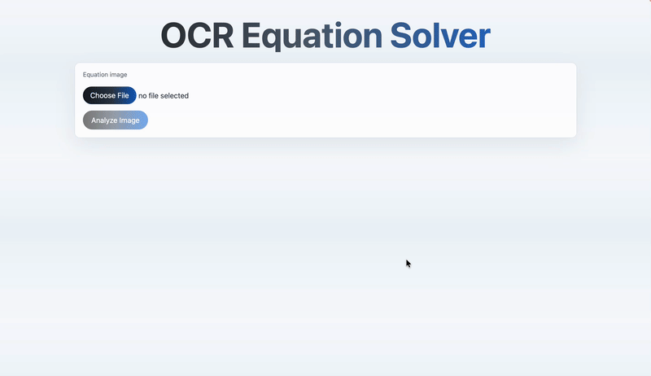

# OCR Equation Solver

This project is a simple full-stack app for solving linear equations from an uploaded image.

The C++ solver performs OCR with Tesseract, parses the detected equations, builds an Eigen matrix system, classifies the system, solves it when possible, and returns structured JSON. The Node backend handles image uploads and calls the solver executable. The React frontend only handles upload and display.

## Demo



## Architecture

```text
frontend -> backend -> C++ solver
```

- `frontend/`: React + Vite app for uploading an image and displaying results.
- `backend/`: Express API for file upload, solver execution, and static image serving.
- `solver/`: C++17 OCR equation solver using Tesseract, Leptonica, Eigen, and OpenCV.

The solver generates multiple processed versions of the input image, runs OCR on each one, parses the resulting equations, and selects the most reliable result using consensus voting.

## Docker Setup

Docker is the easiest way to run the project because it installs OpenCV, Tesseract, Leptonica, Eigen, CMake, Node, and builds the C++ solver automatically.

From the project root:

```bash
docker compose up --build
```

Then open:

```text
http://localhost:5173
```

The backend runs on:

```text
http://localhost:5001
```

Docker uses named volumes for backend uploads and processed images, so generated files remain available while you are testing.

## C++ Solver Setup

Dependencies:

- CMake
- C++17 compiler
- Eigen
- Tesseract
- Leptonica
- OpenCV

On macOS with Homebrew, install the solver dependencies with:

```bash
brew update
brew install cmake eigen tesseract leptonica opencv
```

Build:

```bash
cd solver
cmake -S . -B build
cmake --build build
```

Run normal terminal mode:

```bash
./build/ocr-equation-solver ../equationsImage2.jpg /opt/homebrew/share/tessdata processed
```

Run JSON mode:

```bash
./build/ocr-equation-solver ../backend/uploads/input.png /opt/homebrew/share/tessdata ../backend/processed/job-123 --json
```

In JSON mode the solver prints only valid JSON to stdout. Errors are printed to stderr and return a non-zero exit code.

## macOS Homebrew Troubleshooting

If the solver builds but fails at runtime with an OpenCV/OpenEXR dynamic library error, repair the Homebrew dependencies manually:

```bash
brew update
brew reinstall openexr
brew reinstall opencv
brew reinstall tesseract
brew reinstall leptonica
brew cleanup
```

Then rebuild the solver:

```bash
cd solver
cmake -S . -B build
cmake --build build
```

## Backend Setup

```bash
cd backend
npm install
cp .env.example .env
npm run dev
```

Environment variables:

```bash
SOLVER_PATH=../solver/build/ocr-equation-solver
TESSDATA_PATH=/opt/homebrew/share/tessdata
PORT=5001
FRONTEND_ORIGIN=http://localhost:5173
```

API:

```text
POST /api/solve
```

Send `multipart/form-data` with an image field named `image`.

The backend serves:

- `/uploads`
- `/processed`

Processed images are kept after each run for debugging and demos.

## Frontend Setup

```bash
cd frontend
npm install
npm run dev
```

Optional environment variable:

```bash
VITE_API_BASE_URL=http://localhost:5001
```

Frontend scripts:

```bash
npm run dev
npm run build
npm run preview
```

## Example Workflow

1. Build the C++ solver.
2. Start the backend on port `5001`.
3. Start the frontend on port `5173`.
4. Upload an image containing linear equations.
5. The backend saves the upload, creates a job folder, and calls the C++ solver.
6. The solver creates processed variants, runs OCR/parse/solve/voting, and returns JSON.
7. The frontend displays the uploaded image, processed images, winner, OCR text, matrix, vector, status, solution, and candidates.
